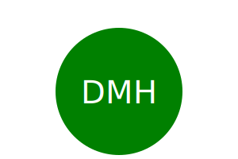

# Hiduchick-SVG-Maker
Hiduchick UNH Bootcamp Challenge 10

## Dscription 
The motivationg behind this application was to build a command line application to allow freelance web developers to create simple logos for their clients and projects so that they can forego paying a graphic designer. It utilizes inquirer to prompt the user within the command line for how they would like their logo to look (ie. what text they would like their logo to display (up to 3 characters in length), the color of that text, the shape of their logo (triangle, square, or circle) and the color of that shape.) Once the user answers all prompts, then an SVG file is written using their selections to generate a logo. It utilizes one test suite, with three tests, all which are simply testing that the code base is delivering back correct shapes and colors. 

## Demo

## Usage
1. Clone the repo 
2. Open the repo in VS code 
3. Open the terminal and run the command npm i to install inquire 
4. After inquire is installed run the command node index.js
5. Answer the questions you are prompted 
6. The SVG file will be automatically generated depending on the answers you give to the questions 

## Installation

1. Clone the repo
   git clone https://github.com/dhiduchick/Hiduchick-README-Generator.git

2. Open in VS Code. If you do not have VS code you must install it.

## Examples

# Author
Created with ♡ by Daelyn Hiduchick